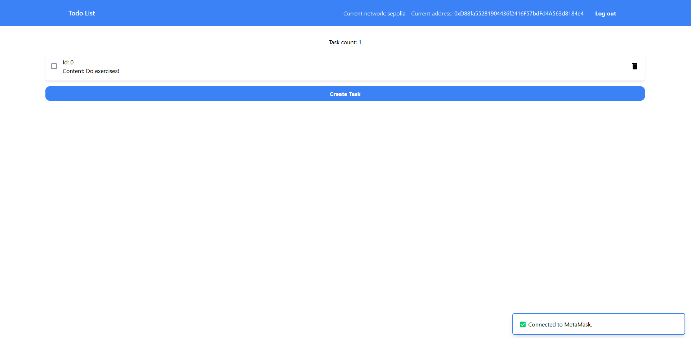

# Todo List 📋

The ToDo List dApp is a React and Solidity-based application that allows users to manage tasks on the blockchain. It offers a secure and transparent way to manage tasks.

Following this tutorial: https://www.dappuniversity.com/articles/blockchain-app-tutorial

## Demo

### Image



### Web site

https://todo-list-smoky-nu.vercel.app/

## Environment Variables

To run this project, you will need to add the following environment variables to your `.env` file

`PROJECT_ID`: Infura project ID.

`MNEMONIC`: Mnemonic of HD wallet.

`ETHERSCAN`: Etherscan API Key

## Run Locally

Clone the project

```bash
git clone https://github.com/aleister1102/TodoList.git
```

Go to the project directory

```bash
cd TodoList
```

Install dependencies

```bash
yarn
```

Start the client

```bash
yarn dev
```

## Deployment

Require recompiling of the smart contracts

```bash
truffle compile
```

To redeploy the smart contracts

```bash
truffle deploy --network sepolia
```
